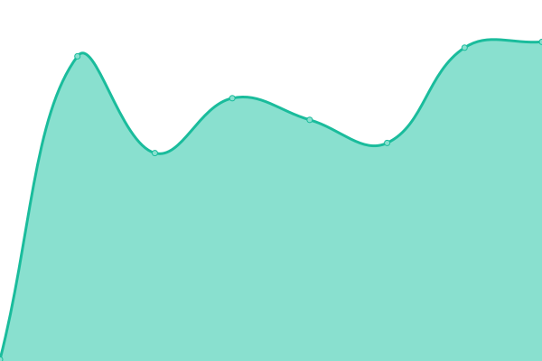

# [📈 Live Status](https://demo.upptime.js.org): <!--live status--> **🟧 Partial outage**

This repository contains the open-source uptime monitor and status page for [Upptime](https://upptime.js.org), powered by [Upptime](https://github.com/upptime/upptime).

With [Upptime](https://upptime.js.org), you can get your own unlimited and free uptime monitor and status page, powered entirely by a GitHub repository. We use [Issues](https://github.com/upptime/upptime/issues) as incident reports, [Actions](https://github.com/tolobis/serviceUptime/actions) as uptime monitors, and [Pages](https://demo.upptime.js.org) for the status page.

<!--start: status pages-->
<!-- This summary is generated by Upptime (https://github.com/upptime/upptime) -->
<!-- Do not edit this manually, your changes will be overwritten -->
<!-- prettier-ignore -->
| URL | Status | History | Response Time | Uptime |
| --- | ------ | ------- | ------------- | ------ |
|  [Geistesgaben](https://geistes-gaben.de) | 🟩 Up | [geistesgaben.yml](https://github.com/tolobis/serviceUptime/commits/HEAD/history/geistesgaben.yml) | 

 240ms
     
 | 

<a href="https://tolobis.github.io/serviceUptime/history/geistesgaben">100.00%</a>
    

|  [GeistesgabenBackend](https://backend.geistes-gaben.de) | 🟥 Down | [geistesgaben-backend.yml](https://github.com/tolobis/serviceUptime/commits/HEAD/history/geistesgaben-backend.yml) | 

 0ms
     
 | 

<a href="https://tolobis.github.io/serviceUptime/history/geistesgaben-backend">0.00%</a>
    

|  [Geistesgaben Database](https://pniujixkkkqyqwowjmwi.supabase.co/rest/v1) | 🟩 Up | [geistesgaben-database.yml](https://github.com/tolobis/serviceUptime/commits/HEAD/history/geistesgaben-database.yml) | 

 162ms
     
 | 

<a href="https://tolobis.github.io/serviceUptime/history/geistesgaben-database">100.00%</a>
    

|  [Geistesgaben Backend Google](https://geistesgabenbackend-372300671037.europe-west1.run.app) | 🟩 Up | [geistesgaben-backend-google.yml](https://github.com/tolobis/serviceUptime/commits/HEAD/history/geistesgaben-backend-google.yml) | 

 186ms
     
 | 

<a href="https://tolobis.github.io/serviceUptime/history/geistesgaben-backend-google">100.00%</a>
    

<!--end: status pages-->

[**Visit our status website →**](https://demo.upptime.js.org)

## 📄 License

- Powered by: [Upptime](https://github.com/upptime/upptime)
- Code: [MIT](./LICENSE) © [Anand Chowdhary](https://anandchowdhary.com), supported by [Pabio](https://pabio.com)
- Data in the `./history` directory: [Open Database License](https://opendatacommons.org/licenses/odbl/1-0/)
